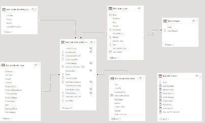

# JanuaryClass
This is an Exploratory Data Analysis of a Sales Data from January 2022-December 2023

# Introduction
This is an example of a demo done using Example1_Data below

---

Click [here](https://docs.github.com/en/get-started/writing-on-github/getting-started-with-writing-and-formatting-on-github/basic-writing-and-formatting-syntax)

## Problem Statement
The goal of this practice is to:

- Familiarize myself with the repository user interface.
- Build confidence structuring my portfolio.
- Ensure good use of data analysis procedures.

## Skills and Concept demonstrated:

SQL (Select, alias, Views)

- PowerBI concepts like:
- creating columns for calculations for dates, time, and duration Creating key performance indicators (KPIs) and other business calculations, Developing general DAX calculations that 
  deal with text and numbers, Performed advanced DAX calculations for solving statistical measures and other mathematical formulas Data Modelling, Measures, Navigation panes, filters, 
  tooltips, buttons, bookmarks, Data Visualization

## Data Modelling:

The intelligence in PowerBI makes it such that tables are automatically joined by creating relationships with them. However, as someone who understands the dataset and wants to get specific insights and information. I had to create other relationships and measures to enable me. so I did another model. I created 7 dimension tables and 2 fact tables as I hoped for a Star Schema.

  Automated Model         | Created Model
:-----------------------: | :-----------------:
 | 

## Limitation

There is a limitation right? 😙
 
